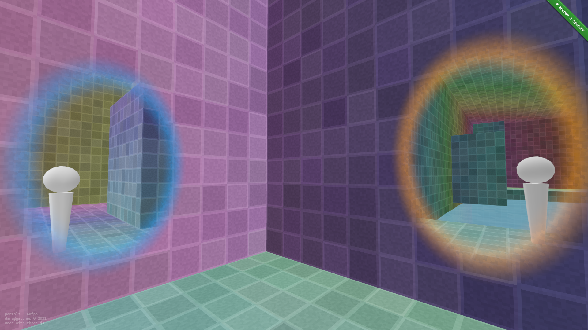

[portals](https://portals.gatunes.com/)
==

[](https://portals.gatunes.com/)

> Portals with ThreeJS

#### Dev environment

```bash
# clone this repo
git clone https://github.com/danielesteban/portals.git
cd portals
# install dev dependencies
npm install
# start the dev environment:
npm start
# Open http://localhost:8080/ in your browser
```
